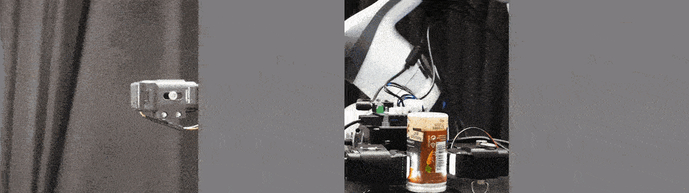

# evetac_software 

<!-- PROJECT LOGO -->
<br />
<div align="center">
  <a href="https://github.com/nifunk/evetac_software">
    
  </a>

  <h3 align="center">Evetac: An Event-based Optical Tactile Sensor
for Robotic Manipulation</h3>
  <h5 align="center">Niklas Funk, Erik Helmut, Georgia Chalvatzaki, Roberto Calandra, Jan Peters</h5>
  <p align="center">
    <a href="https://sites.google.com/view/evetac"><strong>For more information about Evetac, visit the Project Page. »</strong></a> <br />
  </p>
</div>


<!-- TABLE OF CONTENTS -->
<details>
  <summary>Table of Contents</summary>
  <ol>
    <li>
      <a href="#introduction">Introduction</a>
    </li>
    <li>
      <a href="#getting-started">Getting Started</a>
        <ol>
            <li><a href="#prerequisites">Prerequisites</a></li>
            <li><a href="#installation">Installation</a></li>
        </ol>
    </li>
    <li>
        <a href="#usage">Usage</a>
    </li>
    <li>
        <a href="#calibration">Calibration</a>
    </li>
    <li>
        <a href="#questions-and-contributing">Questions and Contributing</a>
    </li> 
    <li>
        <a href="#citing">Citing</a>
    </li>
  </ol>
</details>


<!-- Introduction -->
## Introduction
Welcome to the **evetac_software** repository containing the minimal software interface for working with Evetac. This repository provides the basic functionality for using the sensor, including a ROS interface, calibration routines, and visualization tools.

In this README, you will find guidance on the installation process, usage instructions, and essential information for contributing to the project.

This package is tested on Ubuntu 20.04 with ROS Noetic.


<!-- Getting Started -->
## Getting Started

<!-- Prerequisites -->
### Prerequisites
Make sure you have a working ROS Noetic installation. If not, follow the instructions on the <a href="http://wiki.ros.org/noetic/Installation">ROS Noetic installation page</a>.

<!-- Installation -->
### Installation

#### Step 1: Create a catkin workspace
If you don't have a catkin workspace yet, create one by following the instructions below. If you already have a catkin workspace, you can skip this step.

```console
$ mkdir -p ~/evetac_ws/src
$ cd ~/evetac_ws/
$ catkin build
```

#### Step 2: Clone the repository
Clone the repository into the `src` folder of your catkin workspace.

```console
$ cd ~/evetac_ws/src
$ git clone https://github.com/nifunk/evetac_software.git
$ cd evetac_software
```

#### Step 3: Install dependencies
```console
$ pip3 install -r requirements.txt
```

#### Step 5: Install PyTorch
Make sure you have also PyTorch installed. If not, you can install it by following the instructions on the <a href="https://pytorch.org/get-started/locally/">PyTorch installation page</a>.

#### Step 5: Install dv-processing library
Install the [dv-processing](https://gitlab.com/inivation/dv/dv-processing) library by following the instructions provided in the repo. **Important:** Make sure to build the python bindings.

#### Step 6: Build the catkin workspace
Build and source the catkin workspace.

```console
$ cd ~/evetac_ws
$ catkin build
$ source devel/setup.bash
```


<!-- Usage -->
## Usage
Before you can use the evetac sensor, you need to figure out which camera is connected to your device. You can do this by running the following python commands in a terminal:

```console
$ cd src/evetac_software
$ python3
```

```python
>>> from utils.camera_utils import *
>>> print(get_all_available_cameras())
```

The output will show you the available cameras on your device. Before starting the ROS node, you need to set device's name, i.e., one of the outputs of the previous call as 'cam_name' within `ebcam_readout_node.yaml`. The file is placed inside the `evetac_software/config` folder. If you have multiple cameras connected to your device, you can simple create new config files for each camera.

After doing this, you can start the ROS node with:

```console
$ roslaunch evetac_software ebcam_readout.launch config_ebcam_readout:=src/evetac_software/config/ebcam_readout_node.yaml
```

This node reads the data from the evetac sensor. The data is published on the `/ebcam_msg{cam_id}` topic. Important, inside the `ebcam-readout/track_dots_ros.py` script, there is also a downsampling factor, i.e., `downsample_factor` (line 280) it can be used to reduce the publishing rate of the sensor to `1000 / downsample_factor` Hz. Default the sensor is set to 50Hz, i.e., using a downsampling factor of 20.

You can also start a visualization of the dot tracking by running the following command in a separate terminal:

```console
$ roslaunch evetac_software ebcam_tracking_visualization.launch config_ebcam_tracking_visualization:=src/evetac_software/config/ebcam_tracking_visualization_node.yaml
```

To finnaly visualize the dot tracking, open rqt in a new terminal and select the topic `/intimg{cam_id}`:

```console
$ rqt
```

Moreover, the tracking script also runs some ros services that allows to conveniently start / stop the tracking of dots via:

```console
$ rosservice call /start_keypoint_track{cam_id}
$ rosservice call /stop_keypoint_track{cam_id}
```

Note, the tracking is running by default.

<!-- Calibration -->
## Calibration

There are two ways to calibrate the dot tracking procedure. The faster one starts from an already existing calibration file. This is the procedure that is also shown on our website. Alternatively, you can also create a calibration from scratch which however takes longer and might require additional tuning.

### Calibration from a default calibration file

Upon starting the sensor following this README, the base_calibration file will be loaded. Since your own gel might have different equilibrium locations of the dots, after startup, we recommend to smoothly move over all locations of the gel. Essentially this will initialize the tracking algorithm for all of the dots.
After this procedure you can use two convenient ros services to store the current configuration as the default one and to reinit the tracker.
This can be done via:

```console
$ rosservice call /store_current_dot_calibration{cam_id}
$ rosservice call /reinit_tracker_srv{cam_id}
```
Importantly, the first call will create a new calibration file inside `calibration/calibrations` with the current date and time appended w.r.t. the file that has been loaded on startup. We recommend to use this calibration file as the standard within the `evetac_software/config` file that is loaded upon startup to not having to repeat this procedure when starting up the same sensor the next time.

### Calibration from scratch

The calibration of the Evetac sensor from scratch means to identify the location and radius of the gel's dots in the image. For this, you need to start the event-based camera. For the calibration, we make use of the ROS package of inivation. Follow the installation process [here](https://gitlab.com/inivation/dv/dv-ros). After sourcing the respective workspace, the sensor is brought up via:

```console
$ roslaunch evetac_software event_visualization_calibration.launch
```

This will launch the camera with the required settings. However, in the
rqt window that will just open up, you still have to **enable the noise 
filtering option**!

Next, you can startup the actual file that identifies the dots in the image
plane. The idea is here that the previous script integrates the events for
a period of 1 second. Thus, if you tab upon the gel / rub it very slightly
on the surface, the round dots will create round event patters which can be
extracted using simple opencv functionality.

This procedure of extracting the dots can be launched via

```console
$ python3 calibrate.py --name new_calibration_round_2_12
```

Note: the name argument specifies the name of the calibration file that is
being written.

Running this python script will on the one hand visualize the dots that
are being detected (inside the current frame). On the other hand, there 
is also one topic that visualizes all of the dots found in the image.

Once all the dots are found, you can trigger writing the current location
and sizes of the (so far) found dots by calling to the following rosservice:

```console
$ rosservice call /store_calibration
```

This will store the calibration with the specified name at the specified
path, adding an index _{index} at the end of the file, thus you can actually
call this rosservice multiple times and obtain different calibrations.

Note that a priori the keypoints that will be saved are beforehand visualized
under the topic `/filteredkeypoints`.


<!-- Questions and Contributing -->
## Questions and Contributing
If you have any questions or need help with setting up the sensor, please create an Issue.

We also welcome contributions to this repository. If you would like to contribute, please fork this repository and submit a pull request with your changes, or reach out to niklas [at] robot-learning [dot] de.


<!-- Citing -->
## Citing
If you use this project in your research, please cite it.

```citation
@ARTICLE{EvetacFunk,
  author={Funk, Niklas and Helmut, Erik and Chalvatzaki, Georgia and Calandra, Roberto and Peters, Jan},
  journal={IEEE Transactions on Robotics}, 
  title={Evetac: An Event-based Optical Tactile Sensor for Robotic Manipulation}, 
  year={2024},
  volume={},
  number={},
  pages={1-20},
  keywords={Robots;Tactile sensors;Optical sensors;Cameras;Robot vision systems;Optical feedback;Spatial resolution;Force and Tactile Sensing;Perception for Grasping and Manipulation;Deep Learning in Robotics and Automation;Event-based Sensing},
  doi={10.1109/TRO.2024.3428430}}
```
